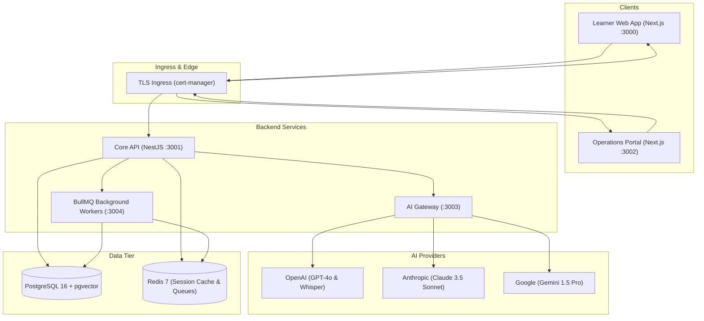

# 🎙️ Daily speaking with me (DSWM) — AI English Speaking Platform

> **Daily speaking with me (DSWM)** is an enterprise-grade, production-ready AI English learning monorepo featuring multi-persona speaking practice, real-time pronunciation forensics, 5-dimension assessment, RAG knowledge retrieval, gamified retention loops, Stripe monetization, and an operations admin portal.

[Phiên bản Tiếng Việt](README.md) | **English**

[](https://www.typescriptlang.org/)
[](https://turbo.build/)
[](https://nextjs.org/)
[](https://nestjs.com/)
[](https://www.postgresql.org/)
[](https://github.com/pgvector/pgvector)
[](https://kubernetes.io/)

---

## 📑 Table of Contents

- [System Architecture](#-system-architecture)
- [Monorepo Workspace Structure](#-monorepo-workspace-structure)
- [Key Features Summary](#-key-features-summary)
- [Getting Started](#-getting-started)
  - [Prerequisites](#prerequisites)
  - [Installation & Setup](#installation--setup)
  - [Starting Infrastructure with Docker](#starting-infrastructure-with-docker)
  - [Database Migration & Seeding](#database-migration--seeding)
  - [Running Development Servers](#running-development-servers)
- [Default Accounts & Credentials](#-default-accounts--credentials)
- [Testing & Quality Assurance](#-testing--quality-assurance)
- [Core REST API Routes](#-core-rest-api-routes)
- [Kubernetes & Production Deployment](#-kubernetes--production-deployment)

---

## 🏛️ System Architecture



---

## 📂 Monorepo Workspace Structure

```text
ai-speaking/
├── apps/
│   ├── web/           # Next.js 15 Student Web Application (Port 3000)
│   ├── admin/         # Next.js 15 Operations & Management Console (Port 3002)
│   ├── api/           # NestJS REST API Gateway & Business Logic (Port 3001)
│   ├── workers/       # NestJS + BullMQ Asynchronous Task Processors (Port 3004)
│   └── ai-gateway/    # Multi-LLM Routing & Cost Tracking Service (Port 3003)
├── packages/
│   ├── types/         # Shared TypeScript DTOs, Contracts & Constants
│   ├── prisma/        # Prisma ORM Schema (30+ tables), Migrations & Seed
│   ├── auth/          # JWT, Refresh Token & Role Permission Utilities
│   ├── ai-sdk/        # Unified AI Provider Adapters (OpenAI, Claude, Gemini)
│   ├── ui/            # Shared React UI Component Library
│   ├── utils/         # Date, String & Format Utility Helpers
│   ├── logger/        # Centralized Logging with OpenTelemetry support
│   └── config/        # Shared ESLint, Prettier & TypeScript Configs
├── infrastructure/
│   ├── k8s/           # Production Kubernetes Manifests (Deployments, HPA, Ingress)
│   ├── observability/ # Prometheus metrics & Grafana dashboard JSON
│   ├── argocd/        # ArgoCD GitOps Continuous Delivery manifests
│   └── load-tests/    # k6 Load Testing script (10,000 concurrent VUs)
└── .planning/         # Full Project Memory & Phased Roadmap Documentation
```

---

## ✨ Key Features Summary

### 1. 🎙️ Speaking Engine & 5-Dimension Speech Assessment
- **HTML5 Web Audio Recording:** Browser `MediaRecorder` audio capture with interactive real-time Canvas waveform visualizer.
- **Whisper Speech-to-Text (STT):** High-accuracy transcription with phonetic error pinpointing.
- **5-Dimension Scoring Formula:**
  $$\text{Overall Score} = 0.25P + 0.20F + 0.20G + 0.20V + 0.15C$$
  - **Pronunciation (25%):** Phoneme precision, syllable stress, intonation.
  - **Fluency (20%):** Words per minute (WPM), speech pauses, filler word detection.
  - **Grammar (20%):** Tense consistency, sentence clause structure.
  - **Vocabulary (20%):** Lexical range, topic relevance, C1/C2 advanced collocations.
  - **Coherence (15%):** Logical transitions and discourse markers.
- **CEFR & IELTS Band Mapping:** Automatic calculation of CEFR bands ($A1 \to C2$) and IELTS speaking scores ($3.0 \to 9.0$).

### 2. 🤖 AI Conversation Studio & Multi-Persona Practice
- **Multi-Persona Roles:** Practice with **Teacher**, **Job Interviewer (STAR method)**, **IELTS Examiner**, **Business Partner**, and **Daily Friend**.
- **Dynamic Multi-LLM Router:** Automated task routing to optimal providers (GPT-4o for grammar/scoring, Claude for deep long-turn dialogue, Gemini for fast practice) with automatic fallback.
- **Two-Tier Context Memory:** Redis for low-latency session memory and PostgreSQL for long-term historical dialogue.

### 3. 🧠 RAG Knowledge Engine (`pgvector`)
- Ingests grammar rules, IELTS cue cards, vocabulary lists, and business templates.
- Vector search with `pgvector` retrieves the Top-K relevant linguistic contexts to guide AI responses.

### 4. 📚 Structured Curriculum & Lesson Viewer
- Interactive multimedia courses supporting **Text**, **Video**, **Quiz**, and **Speaking practice studio** modules.
- Real-time progress tracking for lessons and overall course completion.

### 5. 🏆 Gamification & Retention Engine
- **Daily Streak Tracker:** Real-time calendar-day streak tracking with flame badges, personal best records, and at-risk notifications.
- **Milestone Achievements:** Real-time criteria checking and automatic medal unlocks (*First Conversation*, *7-Day Streak*, *30-Day Streak*, *100 Conversations*, *1000 Minutes Speaking*).

### 6. 💳 Monetization, Quotas & Stripe Checkout
- **Free Plan Quota:** Free accounts are limited to 10 AI conversations/day enforced by [`QuotaGuard`](file:///home/alex/ai-speaking/apps/api/src/modules/subscriptions/guards/quota.guard.ts).
- **Premium Plan:** Unlimited practice sessions ($9.99/mo or $79.99/yr with 33% discount).
- **Stripe & Sandbox Mode:** Supports live Stripe checkout webhooks and an automated **Sandbox mode** for frictionless local testing without requiring real Stripe API keys.
- **Automated Invoicing:** Generates itemized invoices (`INV-XXXXXX`) for completed payments.

### 7. 🔔 In-App Notification Center
- Dropdown notification bell in the navigation bar with dynamic unread badge counter.
- One-click "Mark all as read" and BullMQ asynchronous email dispatching.

### 8. 🎯 Adaptive Learning Path
- Personalized lesson and drill recommendations generated based on the learner's lowest scores among the 5 assessment dimensions.

### 9. 📊 Operations Admin Portal (`apps/admin` :3002)
- **Executive KPI Dashboard:** Real-time DAU, MAU, Total Conversations, Assessments, and Gross Revenue.
- **User Directory:** Filter learners by role and status; change roles (`user` $\leftrightarrow$ `premium` $\leftrightarrow$ `admin`) or suspend accounts.
- **AI Prompt Studio:** Edit system prompt templates with live temperature adjustment and automated versioning (`v1` $\to$ `v2` $\to$ `v3`).
- **Audit Logs:** Immutable chronological log of all administrative actions.

### 10. 🚀 Production Infrastructure & GitOps
- Production Kubernetes manifests with **Horizontal Pod Autoscaling (HPA)**, Ingress TLS, Prometheus/Grafana observability, and ArgoCD GitOps continuous deployment.

---

## 🚀 Getting Started

### Prerequisites

- **Node.js**: `v20.x` or higher (`v26.x` tested)
- **pnpm**: `v9.x` or higher
- **Docker & Docker Compose** (for PostgreSQL and Redis)

---

### Installation & Setup

1. **Clone the repository:**
   ```bash
   git clone https://github.com/alex/ai-speaking.git
   cd ai-speaking
   ```

2. **Install monorepo dependencies:**
   ```bash
   pnpm install
   ```

3. **Configure Environment Variables:**
   ```bash
   cp .env.example .env
   ```
   *(The default `.env.example` is pre-configured with working local development defaults).*

---

### Starting Infrastructure with Docker

Launch PostgreSQL (with `pgvector`) and Redis:

```bash
docker compose up -d
```

Verify services are healthy:
```bash
docker compose ps
```

---

### Database Migration & Seeding

Generate Prisma client, run database migrations, and seed initial data:

```bash
# Generate Prisma Client
pnpm db:generate

# Apply Database Migrations
pnpm db:migrate

# Seed Subscription Plans, Admin User, AI Models, and Starter Course
pnpm db:seed
```

---

### Running Development Servers

Start all applications in development mode with hot-reloading:

```bash
pnpm dev
```

The services will be accessible at:
- 🌐 **Student Web App:** [http://localhost:3000](http://localhost:3000)
- 📊 **Admin Portal:** [http://localhost:3002](http://localhost:3002)
- ⚡ **Backend REST API:** [http://localhost:3001](http://localhost:3001)
- 🤖 **AI Gateway:** [http://localhost:3003](http://localhost:3003)

---

## 🔑 Default Accounts & Credentials

The seed script creates the following default accounts for testing:

| Role | Email | Password | Access / Permissions |
| :--- | :--- | :--- | :--- |
| **Super Admin** | `admin@ai-speaking.com` | `Admin@123456` | Full access to Admin Portal (`:3002`) & all Admin APIs |
| **Standard Learner** | *(Register via `/register`)* | *(Configurable)* | Free plan (10 conversations/day) |
| **Premium Learner** | *(Upgrade via `/pricing`)* | *(Configurable)* | Unlimited AI practice sessions |

---

## 🧪 Testing & Quality Assurance

### Run Unit Tests
Execute the automated test suite (scoring formulas, streak calculations, quota rules):
```bash
pnpm --filter @ai-platform/api test
```

### Typecheck All Workspaces
Verify zero TypeScript errors across all 13 workspace packages:
```bash
pnpm typecheck
```

### Build Production Bundles
Build all applications (`web`, `admin`, `api`, `workers`, `ai-gateway`):
```bash
pnpm build
```

### Run k6 Load Test (10,000 Concurrent Users)
Simulate high-concurrency traffic against the API:
```bash
k6 run infrastructure/load-tests/k6-load-test.js
```

---

## 📡 Core REST API Routes

### Authentication (`/api/v1/auth`)
- `POST /register`: Register with email and password
- `POST /login`: Log in, returns JWT access and refresh token
- `POST /refresh`: Refresh access token
- `POST /logout`: Revoke session token

### AI Speaking & Assessment (`/api/v1/assessments`)
- `POST /upload`: Multipart audio file upload & speech evaluation
- `POST /`: Submit transcript/audio ID for 5-dimension scoring
- `GET /history`: Learner speaking assessment history
- `GET /:id`: Detailed assessment breakdown with word phonetics

### AI Conversations (`/api/v1/conversations`)
- `POST /`: Start conversation with selected persona (Teacher, Interviewer, etc.)
- `GET /`: List active and past user conversations
- `POST /:id/messages`: Send user message and receive AI response
- `GET /:id/stream`: Server-Sent Events (SSE) for streaming text

### Subscriptions & Quota (`/api/v1/subscriptions`)
- `GET /plans`: List available subscription plans
- `GET /current`: Current user plan and validity
- `GET /quota`: Check daily conversation quota (e.g. 3/10 used)

### Payments (`/api/v1/payments`)
- `POST /checkout`: Create Stripe or Sandbox checkout session
- `POST /webhook`: Stripe webhook handler
- `POST /mock-complete`: Sandbox instant checkout completion for testing
- `GET /history`: User transaction and invoice history

### Gamification (`/api/v1/gamification`)
- `GET /streak`: Current streak, longest streak, and daily practice status
- `GET /achievements`: All achievements and unlock status
- `POST /record-activity`: Record practice action to maintain streak

### Notifications (`/api/v1/notifications`)
- `GET /`: User notifications list
- `GET /unread-count`: Number of unread notifications
- `PATCH /:id/read`: Mark notification as read
- `PATCH /read-all`: Mark all notifications as read

### Admin & Operations (`/api/v1/admin`) — *Admin Role Required*
- `GET /users`: Paginated user list with activity metrics
- `PATCH /users/:id`: Change role or suspend/activate account
- `GET/POST/PATCH /courses`: Course catalog management
- `GET/PATCH /prompts`: View and update AI prompt templates
- `GET /audit-logs`: Chronological administrative audit trail

### Analytics (`/api/v1/analytics`)
- `GET /dashboard`: Executive KPIs (DAU, MAU, revenue, trends) — *Admin only*
- `GET /user`: User-facing learning statistics

---

## ☸️ Kubernetes & Production Deployment

All manifests are located in [`infrastructure/k8s/`](file:///home/alex/ai-speaking/infrastructure/k8s).

### 1. Apply Kubernetes Manifests:
```bash
# 1. Create namespace
kubectl apply -f infrastructure/k8s/namespace.yaml

# 2. Apply ConfigMap and Secrets
kubectl apply -f infrastructure/k8s/configmap.yaml
kubectl apply -f infrastructure/k8s/secrets.yaml

# 3. Deploy API, Web, Admin, and Workers
kubectl apply -f infrastructure/k8s/api-deployment.yaml
kubectl apply -f infrastructure/k8s/web-deployment.yaml
kubectl apply -f infrastructure/k8s/admin-deployment.yaml
kubectl apply -f infrastructure/k8s/worker-deployment.yaml

# 4. Deploy Ingress & Auto-Scalers (HPA)
kubectl apply -f infrastructure/k8s/ingress.yaml
kubectl apply -f infrastructure/k8s/hpa.yaml
```

### 2. ArgoCD Continuous Deployment (GitOps):
```bash
kubectl apply -f infrastructure/argocd/application.yaml
```

### 3. Observability (Prometheus & Grafana):
- Apply Prometheus scrape configuration: [`infrastructure/observability/prometheus-config.yaml`](file:///home/alex/ai-speaking/infrastructure/observability/prometheus-config.yaml)
- Import Grafana dashboard: [`infrastructure/observability/grafana-dashboard.json`](file:///home/alex/ai-speaking/infrastructure/observability/grafana-dashboard.json)

---

## 📄 License

Private & Confidential — AI English Speaking Platform Team.
