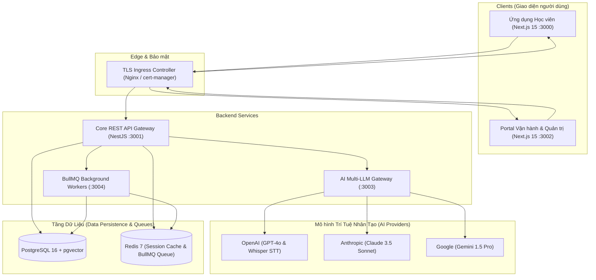

# 🎙️ Daily speaking with me (DSWM) — Nền Tảng Luyện Nói Tiếng Anh Thông Minh Với AI

> **Daily speaking with me (DSWM)** là hệ sinh thái Monorepo chuẩn doanh nghiệp (Production-Ready) hỗ trợ luyện nói tiếng Anh tương tác với AI: Chấm điểm phát âm chi tiết 5 chiều, phòng đàm thoại đa nhân vật (Multi-Persona), truy xuất tri thức RAG (`pgvector`), gamification giữ chân người học, thanh toán Stripe & Sandbox, cùng Portal quản trị vận hành chuyên sâu.

[English Version](README.md) | **Phiên bản Tiếng Việt**

---

## 📑 Mục Lục

1. [Tổng Quan Kiến Trúc Hệ Thống](#-tổng-quan-kiến-trúc-hệ-thống)
2. [Cấu Trúc Thư Mục Monorepo](#-cấu-trúc-thư-mục-monorepo)
3. [Tóm Tắt Các Tính Năng Nổi Bật Có Thể Sử Dụng](#-tóm-tắt-các-tính-năng-nổi-bật-có-thể-sử-dụng)
4. [Hướng Dẫn Cài Đặt & Khởi Chạy Nhanh (Local Dev)](#-hướng-dẫn-cài-đặt--khởi-chạy-nhanh-local-dev)
   - [Yêu Cầu Môi Trường](#1-yêu-cầu-môi-trường)
   - [Cài Đặt Thư Viện](#2-cài-đặt-thư-viện)
   - [Cấu Hình Biến Môi Trường](#3-cấu-hình-biến-môi-trường)
   - [Khởi Động Cơ Sở Dữ Liệu Với Docker](#4-khởi-động-cơ-sở-dữ-liệu-với-docker)
   - [Chạy Migration & Nạp Dữ Liệu Mẫu (Seed)](#5-chạy-migration--nạp-dữ-liệu-mẫu-seed)
   - [Khởi Động Tất Cả Ứng Dụng](#6-khởi-động-tất-cả-ứng-dụng)
5. [Tài Khoản Đăng Nhập Mặc Định](#-tài-khoản-đăng-nhập-mặc-định)
6. [Hướng Dẫn Sử Dụng Từng Phân Hệ](#-hướng-dẫn-sử-dụng-từng-phân-hệ)
   - [Dành Cho Học Viên (Student App - Port 3000)](#61-dành-cho-học-viên-student-app---port-3000)
   - [Dành Cho Quản Trị Viên (Admin Portal - Port 3002)](#62-dành-cho-quản-trị-viên-admin-portal---port-3002)
7. [Kiểm Thử & Đảm Bảo Chất Lượng](#-kiểm-thử--đảm-bảo-chất-lượng)
8. [Danh Mục REST API Chính](#-danh-mục-rest-api-chính)
9. [Triển Khai Môi Trường Production (Kubernetes & GitOps)](#-triển-khai-môi-trường-production-kubernetes--gitops)

---

## 🏛️ Tổng Quan Kiến Trúc Hệ Thống

Hệ thống được thiết kế theo mô hình Microservices/Monorepo phân tầng chịu tải cao:



---

## 📂 Cấu Trúc Thư Mục Monorepo

```text
ai-speaking/
├── apps/
│   ├── web/           # Giao diện Web Học viên (Next.js 15 App Router - Port 3000)
│   ├── admin/         # Portal Quản trị & Vận hành (Next.js 15 App Router - Port 3002)
│   ├── api/           # Backend Core REST API Gateway (NestJS 10 - Port 3001)
│   ├── workers/       # Worker xử lý bất đồng bộ qua BullMQ (Port 3004)
│   └── ai-gateway/    # Dịch vụ định tuyến Multi-LLM & tính toán chi phí (Port 3003)
├── packages/
│   ├── types/         # Định nghĩa kiểu dữ liệu TypeScript dùng chung, DTOs & Contracts
│   ├── prisma/        # Schema Prisma ORM (>30 bảng dữ liệu), Migrations & Seed data
│   ├── auth/          # Tiện ích bảo mật JWT, xoay vòng Refresh Token & Role Guards
│   ├── ai-sdk/        # Adapter AI trừu tượng hóa cho OpenAI, Claude và Gemini
│   ├── ui/            # Thư viện UI component chuẩn React dùng chung
│   ├── utils/         # Hàm tiện ích xử lý chuỗi, định dạng ngày tháng & tiền tệ
│   ├── logger/        # Logging tập trung hỗ trợ OpenTelemetry và chuẩn structured JSON
│   └── config/        # Bộ cấu hình ESLint, Prettier và TypeScript dùng chung
├── infrastructure/
│   ├── k8s/           # Manifests Kubernetes production (Deployments, Ingress, HPA)
│   ├── observability/ # File cấu hình Prometheus scraper & dashboard Grafana JSON
│   ├── argocd/        # Manifest ứng dụng triển khai liên tục GitOps (ArgoCD)
│   └── load-tests/    # Kịch bản k6 Load Testing mô phỏng 10,000 người dùng đồng thời
└── .planning/         # Toàn bộ tài liệu lộ trình 7 Phases và nhật ký kiến trúc hệ thống
```

---

## ✨ Tóm Tắt Các Tính Năng Nổi Bật Có Thể Sử Dụng

Khi sở hữu và sử dụng resource này, bạn có thể khai thác và triển khai ngay các tính năng cao cấp sau:

### 1. 🎙️ Công Cụ Thu Âm & Chấm Điểm Phát Âm Chi Tiết 5 Chiều
- **Thu âm thời gian thực trên trình duyệt:** Tích hợp `MediaRecorder` API và Canvas Visualizer vẽ dạng sóng âm thanh động khi người dùng nói.
- **Chuyển giọng nói thành văn bản (Speech-to-Text):** Tích hợp OpenAI Whisper để bóc tách giọng nói với độ chính xác cao.
- **Chấm điểm theo công thức sư phạm 5 chiều:**
  $$\text{Tổng điểm} = 0.25P + 0.20F + 0.20G + 0.20V + 0.15C$$
  - **Pronunciation (Phát âm - 25%):** Đánh giá độ chuẩn âm vị (phoneme), trọng âm từ (stress) và ngữ điệu (intonation).
  - **Fluency (Độ lưu loát - 20%):** Tốc độ nói từ trên phút (WPM), khoảng dừng ngập ngừng, phát hiện từ đệm ậm ừ (*uh, um, like*).
  - **Grammar (Ngữ pháp - 20%):** Kiểm tra tính nhất quán của thì, sự hòa hợp chủ vị, cấu trúc câu phức.
  - **Vocabulary (Vốn từ vựng - 20%):** Độ rộng của từ vựng, mức độ phù hợp chủ đề, phát hiện collocations và từ vựng nâng cao C1/C2.
  - **Coherence (Độ mạch lạc - 15%):** Mức độ liên kết câu, sử dụng từ nối (discourse markers) và logic chuyển ý.
- **Quy đổi chuẩn quốc tế:** Tự động quy đổi điểm sang bậc CEFR ($A1 \to C2$) và thang điểm IELTS Speaking ($3.0 \to 9.0$).
- **Bóc tách lỗi chi tiết từng từ (Word-Level Phonetic Breakdown):** Hiển thị rõ từ nào nói đúng, từ nào phát âm sai, vị trí nhấn sai trọng âm cùng hướng dẫn khẩu hình sửa lỗi.

### 2. 🤖 Phòng Luyện Hội Thoại Đa Nhân Vật AI (Multi-Persona Studio)
- **5 Vai trò AI chuyên biệt:**
  1. **Teacher (Giáo viên bản xứ):** Giải thích cặn kẽ, sửa lỗi từ tốn, khuyến khích học viên mở rộng ý.
  2. **Job Interviewer (Nhà tuyển dụng chuyên nghiệp):** Phỏng vấn bằng phương pháp STAR (*Situation, Task, Action, Result*).
  3. **IELTS Examiner (Giám khảo IELTS):** Mô phỏng thi Speaking Part 1, Part 2, Part 3 với đồng hồ đếm ngược và bộ tiêu chí chấm thi Cambridge.
  4. **Business Partner (Đối tác kinh doanh):** Luyện đàm phán hợp đồng, thuyết trình dự án và trao đổi công sở.
  5. **Daily Friend (Bạn bè giao tiếp):** Hội thoại tự nhiên đời thường, sử dụng tiếng lóng (slang), thành ngữ (idioms) thực tế.
- **AI Gateway Thông Minh:** Tự động phân bổ tác vụ đến model tối ưu (GPT-4o cho phân tích ngữ pháp, Claude 3.5 Sonnet cho hội thoại chiều sâu, Gemini 1.5 Pro cho tốc độ phản hồi nhanh) cùng cơ chế failover dự phòng.
- **Bộ nhớ ngữ cảnh 2 tầng:** Tầng 1 sử dụng Redis lưu ngữ cảnh hội thoại siêu tốc (<5ms); Tầng 2 lưu trữ lịch sử dài hạn vào PostgreSQL.
- **Phản hồi dạng luồng (Streaming SSE):** Chữ chạy mượt mà theo thời gian thực như trò chuyện với người thật.

### 3. 🧠 Tìm Kiếm Ngữ Liệu RAG Với `pgvector`
- Tích hợp tài liệu ngữ pháp, đề thi mẫu IELTS Speaking Forecast, kho từ vựng chuyên ngành.
- Vector search bằng Cosine Distance trên PostgreSQL 16 `pgvector` để trích xuất Top-K ngữ cảnh liên quan nhất đưa vào Prompt cho AI.

### 4. 📚 Khóa Học & Bài Học Đa Dạng
- Hỗ trợ đầy đủ các dạng nội dung: Bài đọc lý thuyết, Video bài giảng, Trắc nghiệm kiến thức (Quiz), và Phòng thực hành nói tương tác (Speaking Practice Studio).
- Tự động theo dõi tiến trình học tập và hoàn thành khóa học.
- **Lộ trình học thích ứng (Adaptive Learning):** Hệ thống phân tích điểm yếu nhất trong 5 chiều đánh giá của học viên để tự động gợi ý bài học và bài tập bù đắp lỗ hổng.

### 5. 🏆 Gamification Giữ Chân Người Học (Retention Loops)
- **Chuỗi ngày học liên tục (Daily Streak):** Theo dõi chuỗi học với biểu tượng ngọn lửa rực sáng, ghi nhận kỷ lục chuỗi dài nhất và cảnh báo nguy cơ đứt chuỗi nếu chưa luyện tập trong ngày.
- **Hệ thống Huy Hiệu Thành Tựu:** Tự động mở khóa các danh hiệu khi đạt mốc (*Buổi học đầu tiên, Chuỗi 7 ngày, Chuỗi 30 ngày, 100 cuộc hội thoại, 1000 phút luyện nói,...*).

### 6. 💳 Cơ Chế Gói Đăng Ký (Freemium), Quota Hàng Ngày & Thanh Toán
- **Gói Miễn Phí (Free Plan):** Giới hạn tối đa 10 lượt hội thoại/ngày, được kiểm soát bảo mật bởi `QuotaGuard`.
- **Gói Cao Cấp (Premium Plan):** Mở khóa không giới hạn lượt nói và các bài kiểm tra chuyên sâu ($9.99/tháng hoặc $79.99/năm - tiết kiệm 33%).
- **Tích Hợp Stripe & Chế Độ Sandbox Độc Lập:**
  - Tích hợp luồng thanh toán Stripe Checkout và Webhook bảo mật.
  - **Sẵn sàng chế độ Sandbox Mode:** Cho phép người dùng hoặc lập trình viên kiểm thử nâng cấp gói, thanh toán, hạ gói hoặc gia hạn ngay lập tức tại môi trường phát triển mà không cần tài khoản hay thẻ Stripe thật.
- **Hóa đơn tự động:** Tự động sinh mã hóa đơn (`INV-XXXXXX`) và lưu trữ lịch sử giao dịch.

### 7. 🔔 Trung Tâm Thông Báo Đa Kênh
- Biểu tượng chuông thông báo trên thanh điều hướng với bộ đếm tin chưa đọc theo thời gian thực.
- Xem nhanh danh sách thông báo, đánh dấu đã đọc từng tin hoặc tất cả trong 1 chạm.
- Tích hợp BullMQ Background Worker sẵn sàng gửi email nhắc nhở học tập hàng ngày.

### 8. 📊 Portal Quản Trị Vận Hành Doanh Nghiệp (`apps/admin` :3002)
- **Bảng Điều Khiển Tổng Quan (Executive KPI Dashboard):** Giám sát thời gian thực người dùng hoạt động ngày (DAU), người dùng tháng (MAU), tổng số lượt đàm thoại, bài chấm điểm phát âm và doanh thu thực tế.
- **Quản lý người dùng:** Danh sách phân trang, tìm kiếm, lọc theo vai trò; thay đổi quyền hạn người dùng (`user` $\leftrightarrow$ `premium` $\leftrightarrow$ `admin`) hoặc tạm khóa tài khoản.
- **AI Prompt Studio:** Trực quan hóa và chỉnh sửa nội dung System Prompt cho các Persona AI, điều chỉnh Temperature và tự động đánh số phiên bản (`v1` $\to$ `v2` $\to$ `v3`).
- **Quản lý danh mục khóa học:** Xem và cập nhật các khóa học tiếng Anh.
- **Nhật ký kiểm toán (Audit Logs):** Lưu vết toàn bộ hành vi của quản trị viên kèm địa chỉ IP và dấu thời gian, phục vụ bảo mật và rà soát hệ thống.

---

## 🚀 Hướng Dẫn Cài Đặt & Khởi Chạy Nhanh (Local Dev)

### 1. Yêu Cầu Môi Trường
- **Node.js**: Phiên bản `v20.x` trở lên (Đã kiểm thử tối ưu trên Node.js `v26.x`).
- **pnpm**: Phiên bản `v9.x` trở lên (`npm i -g pnpm`).
- **Docker & Docker Compose**: Để khởi chạy PostgreSQL 16 và Redis 7.

---

### 2. Cài Đặt Thư Viện

Clone mã nguồn và cài đặt các phụ thuộc cho toàn bộ 13 packages trong monorepo:

```bash
# Clone repository
git clone https://github.com/alex/ai-speaking.git
cd ai-speaking

# Cài đặt tất cả dependencies
pnpm install
```

---

### 3. Cấu Hình Biến Môi Trường

Sao chép file mẫu `.env.example` thành `.env`:

```bash
cp .env.example .env
```

> [!TIP]
> File `.env.example` đã được cấu hình sẵn các giá trị mặc định tối ưu cho môi trường local (kết nối PostgreSQL, Redis, Secret JWT,...). Bạn có thể thêm khóa `OPENAI_API_KEY`, `ANTHROPIC_API_KEY` hoặc `GEMINI_API_KEY` nếu muốn thử nghiệm với các AI provider thực tế; nếu không điền, hệ thống sẽ sử dụng fallback adapter an toàn.

---

### 4. Khởi Động Cơ Sở Dữ Liệu Với Docker

Khởi chạy PostgreSQL 16 (có sẵn extension `pgvector`) và Redis 7:

```bash
docker compose up -d
```

Kiểm tra trạng thái container:
```bash
docker compose ps
```
Cả hai container `postgres` (port `5432`) và `redis` (port `6379`) phải ở trạng thái `Up` hoặc `healthy`.

---

### 5. Chạy Migration & Nạp Dữ Liệu Mẫu (Seed)

Khởi tạo các bảng dữ liệu Prisma và nạp dữ liệu mẫu (các gói cước, tài khoản admin, AI prompt mẫu, khóa học khởi đầu):

```bash
# Sinh mã nguồn Prisma Client
pnpm db:generate

# Chạy migrations để tạo các bảng trong PostgreSQL
pnpm db:migrate

# Nạp dữ liệu ban đầu
pnpm db:seed
```

---

### 6. Khởi Động Tất Cả Ứng Dụng

Khởi chạy toàn bộ hệ thống bằng một lệnh duy nhất:

```bash
pnpm dev
```

Sau khi khởi động thành công, các dịch vụ sẽ hoạt động tại các địa chỉ:

| Ứng Dụng / Dịch Vụ | Địa Chỉ Local | Mục Đích Sử Dụng |
| :--- | :--- | :--- |
| 🌐 **Student Web App** | [http://localhost:3000](http://localhost:3000) | Giao diện học viên luyện nói, làm bài tập, nâng cấp tài khoản |
| 📊 **Admin Portal** | [http://localhost:3002](http://localhost:3002) | Bảng điều khiển quản trị, quản lý người dùng, tinh chỉnh AI Prompt |
| ⚡ **Core REST API** | [http://localhost:3001](http://localhost:3001) | Cổng API backend chính (NestJS) |
| 🤖 **AI Gateway** | [http://localhost:3003](http://localhost:3003) | Dịch vụ điều phối Multi-LLM |
| ⚙️ **BullMQ Workers** | Port `3004` | Xử lý ngầm các tác vụ nặng (chấm điểm, thông báo, tổng hợp số liệu) |

---

## 🔑 Tài Khoản Đăng Nhập Mặc Định

Sau khi chạy lệnh `pnpm db:seed`, hệ thống đã chuẩn bị sẵn tài khoản:

| Vai Trò | Email | Mật Khẩu | Quyền Hạn Truy Cập |
| :--- | :--- | :--- | :--- |
| 👑 **Super Admin** | `admin@ai-speaking.com` | `Admin@123456` | Toàn quyền đăng nhập Admin Portal ([http://localhost:3002](http://localhost:3002)) và gọi API quản trị |
| 👤 **Học Viên Miễn Phí** | Đăng ký trực tiếp tại `/register` | Tự đặt | Giới hạn 10 lượt hội thoại/ngày |
| ⭐ **Học Viên Premium** | Nâng cấp tại trang `/pricing` | Tự đặt | Không giới hạn lượt luyện nói với AI |

---

## 💡 Hướng Dẫn Sử Dụng Từng Phân Hệ

### 6.1. Dành Cho Học Viên (Student App - Port 3000)

1. **Đăng ký / Đăng nhập:**
   - Truy cập [http://localhost:3000/login](http://localhost:3000/login) hoặc [http://localhost:3000/register](http://localhost:3000/register).
   - Đăng ký một tài khoản mới để bắt đầu với Gói Miễn Phí.

2. **Luyện Đàm Thoại Với AI (`/conversations`):**
   - Vào mục **Conversations**, chọn Persona bạn muốn trò chuyện:
     - Chọn **Teacher** để luyện ngữ pháp thông thường.
     - Chọn **Job Interviewer** để thử thách phỏng vấn xin việc bằng tiếng Anh.
     - Chọn **IELTS Examiner** để thi thử speaking chuẩn format.
   - Nhập tin nhắn văn bản hoặc bấm mic thu âm để trò chuyện trực tiếp.

3. **Luyện Nói & Chấm Điểm 5 Chiều (`/courses/.../lessons`):**
   - Chọn một bài học trong mục **Courses**.
   - Chuyển sang tab **Speaking Practice**.
   - Bấm nút **Bắt đầu thu âm**, nói theo chủ đề và bấm **Dừng & Chấm điểm**.
   - Xem bảng phân tích chi tiết: Điểm tổng, điểm 5 tiêu chí (Pronunciation, Fluency, Grammar, Vocabulary, Coherence) và phân tích từng từ.

4. **Theo Dõi Tiến Trình & Duy Trì Chuỗi Ngày (`/dashboard`):**
   - Trang cá nhân sẽ hiển thị số ngày **Daily Streak** (ngọn lửa), kỷ lục chuỗi ngày và danh sách các huy hiệu thành tựu đã đạt được.

5. **Nâng Cấp Gói Cước (`/pricing`):**
   - Khi đã hết 10 lượt miễn phí trong ngày, truy cập trang **Pricing**.
   - Chọn gói Tháng ($9.99/mo) hoặc Năm ($79.99/yr).
   - Trong môi trường local, bấm thanh toán để kích hoạt luồng **Sandbox Simulation**, hệ thống sẽ tự động nâng cấp tài khoản của bạn lên **Premium** ngay lập tức và sinh hóa đơn giao dịch.

---

### 6.2. Dành Cho Quản Trị Viên (Admin Portal - Port 3002)

1. **Đăng Nhập Quản Trị:**
   - Truy cập [http://localhost:3002/login](http://localhost:3002/login).
   - Nhập email: `admin@ai-speaking.com` và mật khẩu: `Admin@123456`.

2. **Bảng Điều Khiển KPIs (`/`):**
   - Xem tổng quan người dùng hoạt động ngày (DAU), người dùng hoạt động tháng (MAU), số buổi học nói, số bài chấm điểm và tổng doanh thu.

3. **Quản Lý Người Dùng (`/users`):**
   - Tìm kiếm người dùng theo tên hoặc email.
   - Nâng cấp hoặc hạ quyền người dùng giữa `user`, `premium` và `admin`.
   - Khóa (suspend) hoặc kích hoạt lại tài khoản khi cần thiết.

4. **AI Prompt Studio (`/prompts`):**
   - Xem danh sách các mẫu System Prompt cho từng nhân vật AI.
   - Chỉnh sửa chỉ dẫn hành vi của AI, điều chỉnh thanh trượt độ sáng tạo (Temperature).
   - Lưu lại để tạo phiên bản mới (`v1` $\to$ `v2`) mà không làm gián đoạn hệ thống.

5. **Quản Lý Khóa Học (`/courses`):**
   - Xem và điều chỉnh danh sách các khóa học hiện có trên nền tảng.

6. **Nhật Ký Kiểm Toán (`/audit-logs`):**
   - Xem danh sách lưu vết các hoạt động quản trị: Ai đã sửa gì, vào thời điểm nào, từ địa chỉ IP nào.

---

## 🧪 Kiểm Thử & Đảm Bảo Chất Lượng

Hệ thống được thiết lập bộ kiểm thử tự động toàn diện:

### 1. Chạy Unit Tests
Chạy bộ kiểm thử tự động kiểm tra công thức chấm điểm 5 chiều, logic tính streak, và bộ kiểm soát quota:
```bash
pnpm --filter @ai-platform/api test
```
*(Kết quả: 13/13 tests pass 100% qua Node.js test runner)*.

### 2. Kiểm Tra Lỗi Kiểu Dữ Liệu (Typecheck)
Xác thực 100% an toàn kiểu dữ liệu TypeScript trên toàn bộ 13 packages:
```bash
pnpm typecheck
```

### 3. Build Đóng Gói Toàn Bộ Dự Án
Kiểm tra tính toàn vẹn khi đóng gói production:
```bash
pnpm build
```

### 4. Kiểm Thử Chịu Tải Cao (k6 Load Test - 10,000 Người Dùng)
Chạy kịch bản mô phỏng 10,000 người dùng đồng thời gọi API:
```bash
k6 run infrastructure/load-tests/k6-load-test.js
```

---

## 📡 Danh Mục REST API Chính

Tất cả các API được bảo vệ bởi JWT Guard và tiền tố `/api/v1`:

### 🔐 Xác Thực & Tài Khoản (`/api/v1/auth`)
- `POST /register`: Đăng ký tài khoản mới bằng email và mật khẩu
- `POST /login`: Đăng nhập, nhận JWT Access Token và Refresh Token
- `POST /refresh`: Đổi Refresh Token lấy Access Token mới
- `POST /logout`: Hủy phiên đăng nhập hiện tại

### 🎙️ Đánh Giá Phát Âm (`/api/v1/assessments`)
- `POST /upload`: Upload file ghi âm và thực hiện đánh giá phát âm
- `POST /`: Gửi transcript / audio ID để chấm điểm 5 chiều
- `GET /history`: Lịch sử các bài luyện nói của học viên
- `GET /:id`: Chi tiết kết quả chấm điểm kèm phân tích từng âm vị

### 🤖 Đàm Thoại AI (`/api/v1/conversations`)
- `POST /`: Khởi tạo phiên trò chuyện với Persona được chọn
- `GET /`: Danh sách các cuộc trò chuyện của người dùng
- `POST /:id/messages`: Gửi tin nhắn và nhận phản hồi từ AI
- `GET /:id/stream`: Nhận luồng dữ liệu thời gian thực Server-Sent Events (SSE)

### 💳 Gói Cước & Quota (`/api/v1/subscriptions`)
- `GET /plans`: Lấy danh sách các gói cước đang mở bán
- `GET /current`: Xem gói cước hiện tại của tài khoản và hạn sử dụng
- `GET /quota`: Kiểm tra số lượt đàm thoại đã dùng trong ngày (vd: `3/10`)

### 💰 Thanh Toán & Hóa Đơn (`/api/v1/payments`)
- `POST /checkout`: Tạo phiên thanh toán Stripe hoặc Sandbox Checkout
- `POST /webhook`: Xử lý Webhook gửi về từ Stripe
- `POST /mock-complete`: Kích hoạt hoàn tất thanh toán Sandbox tức thì
- `GET /history`: Lịch sử giao dịch và danh sách hóa đơn điện tử

### 🏆 Gamification (`/api/v1/gamification`)
- `GET /streak`: Lấy thông tin chuỗi ngày liên tục và trạng thái luyện tập trong ngày
- `GET /achievements`: Danh sách toàn bộ huy hiệu và trạng thái mở khóa
- `POST /record-activity`: Ghi nhận hoạt động luyện tập để bảo vệ chuỗi ngày

### 🔔 Thông Báo (`/api/v1/notifications`)
- `GET /`: Danh sách thông báo của người dùng
- `GET /unread-count`: Số lượng thông báo chưa đọc
- `PATCH /:id/read`: Đánh dấu một thông báo là đã đọc
- `PATCH /read-all`: Đánh dấu toàn bộ thông báo là đã đọc

### 👑 Quản Trị & Vận Hành (`/api/v1/admin`) — *(Yêu Cầu Quyền Admin)*
- `GET /users`: Danh sách người dùng phân trang kèm chỉ số hoạt động
- `PATCH /users/:id`: Thay đổi vai trò hoặc khóa/kích hoạt tài khoản
- `GET /prompts`: Xem danh sách mẫu System Prompt của AI
- `PATCH /prompts/:id`: Cập nhật nội dung Prompt, tạo phiên bản mới
- `GET /audit-logs`: Nhật ký kiểm toán toàn bộ hành động của admin

### 📈 Thống Kê Dữ Liệu (`/api/v1/analytics`)
- `GET /dashboard`: Chỉ số kinh doanh tổng quan (DAU, MAU, doanh thu) — *Admin*
- `GET /user`: Chỉ số học tập cá nhân của học viên

---

## ☸️ Triển Khai Môi Trường Production (Kubernetes & GitOps)

Tất cả các tài liệu cấu hình được đặt tại thư mục [`infrastructure/`](file:///home/alex/ai-speaking/infrastructure).

### 1. Triển Khai Vào Kubernetes Cluster:
```bash
# 1. Khởi tạo namespace
kubectl apply -f infrastructure/k8s/namespace.yaml

# 2. Áp dụng ConfigMap và Secrets
kubectl apply -f infrastructure/k8s/configmap.yaml
kubectl apply -f infrastructure/k8s/secrets.yaml

# 3. Triển khai các Deployments (API, Web, Admin, Workers)
kubectl apply -f infrastructure/k8s/api-deployment.yaml
kubectl apply -f infrastructure/k8s/web-deployment.yaml
kubectl apply -f infrastructure/k8s/admin-deployment.yaml
kubectl apply -f infrastructure/k8s/worker-deployment.yaml

# 4. Cấu hình Ingress TLS và Tự động co giãn (HPA)
kubectl apply -f infrastructure/k8s/ingress.yaml
kubectl apply -f infrastructure/k8s/hpa.yaml
```

### 2. Triển Khai Liên Tục Bằng GitOps Với ArgoCD:
```bash
kubectl apply -f infrastructure/argocd/application.yaml
```

### 3. Giám Sát Hệ Thống Với Prometheus & Grafana:
- Cấu hình Prometheus scraper: [`infrastructure/observability/prometheus-config.yaml`](file:///home/alex/ai-speaking/infrastructure/observability/prometheus-config.yaml)
- Nhập Dashboard Grafana đã thiết kế sẵn: [`infrastructure/observability/grafana-dashboard.json`](file:///home/alex/ai-speaking/infrastructure/observability/grafana-dashboard.json)

---

## 📄 Bản Quyền & Giấy Phép

Dự án này được phát triển phục vụ mục đích học tập, nghiên cứu và sản phẩm thương mại cho hệ thống AI English Speaking Platform.
